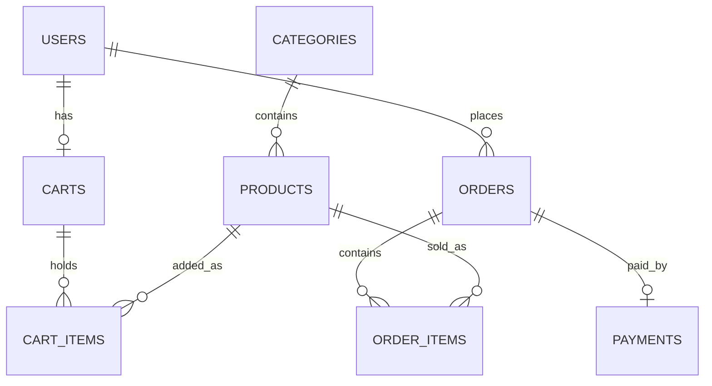

# Order Management System

REST backend for an online shop: product catalog, cart, order placement with stock control, mock payment, and SQL reports.

**Stack:** Java 21, Spring Boot, Spring Data JPA (Hibernate), H2, Bean Validation, BCrypt, JUnit 5 + Mockito, springdoc-openapi.

## Features
- Category and Product CRUD with validation and consistent JSON errors
- Product search with pagination, sorting and filters (keyword, category, price range)
- User registration (BCrypt hashed passwords) with an auto-created cart
- Cart: add, merge duplicates, update quantity, remove, clear, stock check
- Place order in one transaction: stock reduce, price snapshot, cart clear
- Mock payment (success/failure with retry), cancel with stock restore, order status flow
- SQL reports: top products, monthly revenue, customer spend, category sales, unsold products

## Architecture
```
Client -> Controller -> Service -> Repository -> Database
          (HTTP+DTO)    (rules)     (Spring Data JPA)
```
Packages: `controller`, `service`, `repository`, `entity`, `dto`, `exception`, `config`.

## ER Diagram


## Run locally
Requires Java 21.
```bash
git clone https://github.com/sujithavenkadesh/order-management-system.git
cd order-management-system
./mvnw spring-boot:run
```
- Swagger UI: `http://localhost:8080/swagger-ui/index.html`
- H2 console: `http://localhost:8080/h2-console` (JDBC URL `jdbc:h2:mem:omsdb`, user `sa`, empty password)
- Sample products load on startup. For report demo data (users and dated orders):
  `SPRING_PROFILES_ACTIVE=demo ./mvnw spring-boot:run`
- Run tests: `./mvnw test`
- Try requests: open `requests.http` (VS Code REST Client extension)

## Main endpoints
| Area | Endpoints |
|---|---|
| Categories | `POST/GET/PUT/DELETE /api/categories` |
| Products | `POST/GET/PUT/DELETE /api/products`, search: `GET /api/products?keyword=&categoryId=&minPrice=&maxPrice=&page=&size=&sort=` |
| Users | `POST /api/users`, `GET /api/users/{id}` |
| Cart | `GET/DELETE /api/users/{id}/cart`, `POST /api/users/{id}/cart/items`, `PUT/DELETE /api/users/{id}/cart/items/{itemId}` |
| Orders | `POST/GET /api/users/{id}/orders`, `GET /api/orders/{id}`, `POST /api/orders/{id}/pay`, `POST /api/orders/{id}/cancel`, `PATCH /api/orders/{id}/status` |
| Reports | `GET /api/reports/top-products`, `monthly-revenue`, `customer-spend`, `category-sales`, `unsold-products` |

## Design decisions
- **Atomic stock update:** `UPDATE products SET stock = stock - ? WHERE id = ? AND stock >= ?`. Check and reduce happen in one statement, so two concurrent orders cannot oversell the last unit.
- **All-or-nothing ordering:** `placeOrder` is one `@Transactional` method; any failure rolls back stock changes, and the cart is kept.
- **Price snapshot:** `order_items.price_at_purchase` keeps historical totals correct after price changes.
- **Deadlock avoidance:** cart lines are processed in product id order.
- **DTOs everywhere:** entities are never exposed, so password hashes cannot leak.
- **Sort whitelist:** clients can sort only by approved fields.
- **Indexes:** on foreign keys and on `(status, created_at)` for report queries.
- **Reports** count only PAID, SHIPPED and DELIVERED orders.

## Known limitations
- No authentication yet: the user id is in the URL. JWT and role-based access are planned.
- Payment is a mock.
- H2 is in-memory, so data resets on restart. PostgreSQL via Docker Compose is planned.